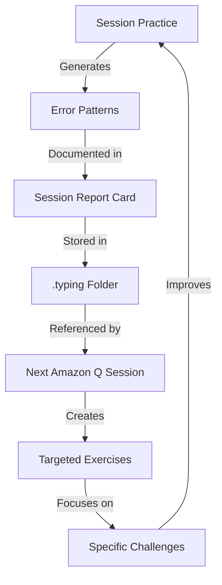

# The Typing Skills Feedback Flywheel

This document explains the emergent learning system created through the interaction between Amazon Q and your typing practice sessions. Unlike traditional learning approaches with predetermined paths, this system creates a self-reinforcing feedback loop that adapts to your specific needs.

## The Flywheel System



## How the Flywheel Works

1. **Input**: Your typing practice generates raw data about your specific challenges
2. **Analysis**: Amazon Q identifies patterns in your errors (not just random mistakes)
3. **Documentation**: These patterns are recorded in structured report cards
4. **Storage**: Reports are preserved in the .typing folder (private, gitignored)
5. **Reference**: Future sessions begin by analyzing your historical patterns
6. **Adaptation**: New exercises are generated specifically for your needs
7. **Targeted Practice**: You work on your specific challenges
8. **Improvement**: Your skills develop in the areas you need most
9. **Repeat**: The cycle continues, constantly refining its focus

## Example: The G/H Boundary Challenge

### Initial Session:
- You type: "The huge gray dog" as "The guhr htau fog"
- Amazon Q identifies: G/H boundary confusion
- Report documents: "★★☆☆☆ G/H Differentiation - Significant challenge"
- Recommendation: "Focus on g=left index, h=right index finger positioning"

### Follow-up Session:
- Amazon Q reads: Previous report showing G/H boundary issues
- Creates: Targeted G/H differentiation exercises
- Starts with: Basic "g h g h" pattern drills
- Progresses to: Simple words with g/h combinations
- Adapts based on: Your performance during the session

### Third Session:
- Amazon Q analyzes: Multiple reports showing progress pattern
- Notes: "Basic g/h patterns mastered, but struggles in complex sentences"
- Creates: Exercises with g/h in sentence context
- Introduces: New challenges only when ready

## The Emergent Quality

What makes this system powerful is that it's not following a predetermined curriculum. Instead:

1. **Self-healing**: The system identifies and addresses weaknesses automatically
2. **Adaptive**: Exercises evolve based on your actual performance, not assumptions
3. **Personalized**: Your specific error patterns drive the learning path
4. **Progressive**: Difficulty increases only when you're ready
5. **Contextual**: Each session builds on the complete history of your practice

## When No History Exists

Even without previous reports, the system still functions:

1. **First Session**: Creates baseline assessment
2. **Initial Report**: Documents starting point challenges
3. **Future Sessions**: Build on this foundation

## Cross-Device Compatibility

If using a new computer without previous reports:

1. Simply inform Amazon Q: "I've been practicing split keyboard typing but don't have my previous reports"
2. Provide brief context: "My main challenge has been the g/h boundary"
3. Amazon Q will: Create appropriate exercises and begin a new report history

## Example Report Card Structure

```markdown
# Typing Skills Development Report Card

## Student Progress Summary
**Date:** April 1, 2025  
**Focus Area:** Split Keyboard Touch Typing  
**Primary Challenge:** Center-line boundaries (g/h and b/n)

## Skill Assessment

| Skill Area | Rating | Notes |
|------------|--------|-------|
| G/H Differentiation | ★★☆☆☆ | Significant challenge; consistent confusion between g and h |
| B/N Differentiation | ★★★★☆ | Strong performance in isolated drills; some regression in complex text |
| Overall Accuracy | ★★☆☆☆ | Accuracy varies significantly based on context complexity |
| Hand Position Awareness | ★★★☆☆ | Improving awareness of which hand handles which keys |
| Complex Text Integration | ★☆☆☆☆ | Challenges increase significantly with sentence complexity |

## What We Covered

1. **Baseline Assessment** - Identified primary challenges with center-line boundaries
2. **Center-Line Accuracy** - Focused exercises on the t/y, g/h, b/n boundaries
3. **G/H Precision Training** - Targeted drills for the most challenging boundary

## Practice Recommendations

### Priority Focus Areas:
1. **G/H Boundary** - This remains your primary challenge and should be the main focus
2. **Simple to Complex Progression** - Continue building from patterns to words to sentences

### Daily Practice Routine:
1. **Morning Warm-up** (5 minutes):
   ```
   g h g h g h g h g h
   gh gh gh gh gh gh gh gh gh gh
   hg hg hg hg hg hg hg hg hg hg
   ```

## Next Session Goals
1. Reassess g/h boundary accuracy
2. Introduce more complex sentence structures if progress is sufficient
3. Begin addressing secondary challenges (if g/h boundary shows improvement)
```

This structured approach creates a living, evolving system that becomes increasingly effective at addressing your specific typing challenges over time.
